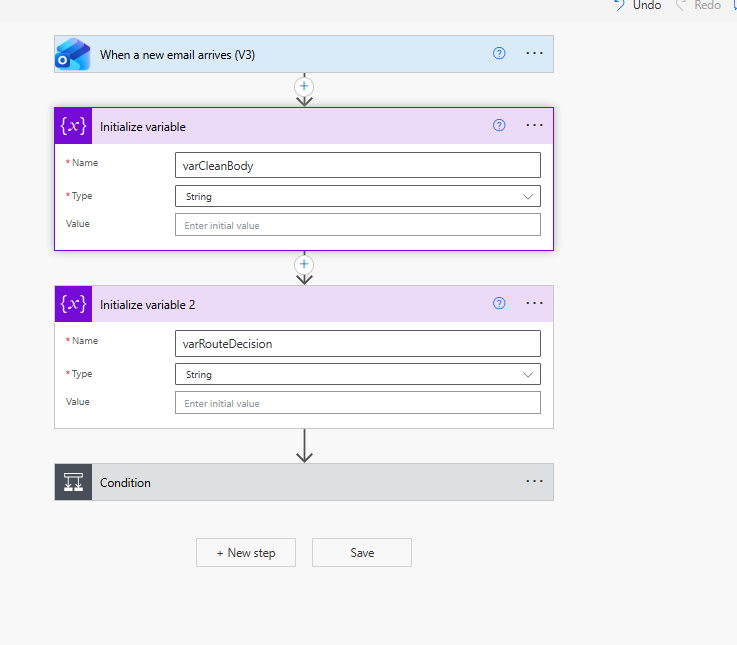
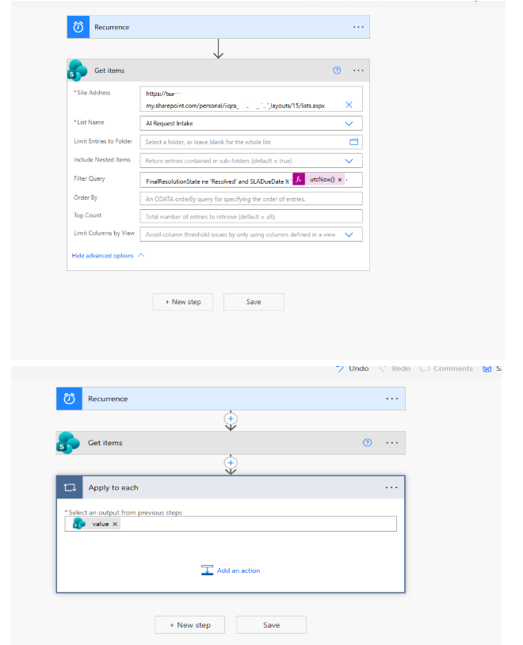
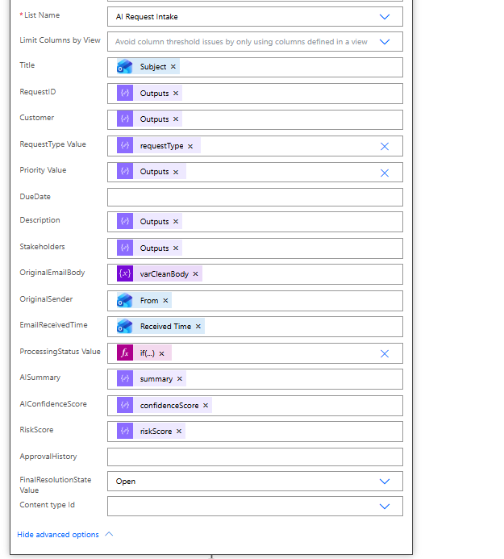
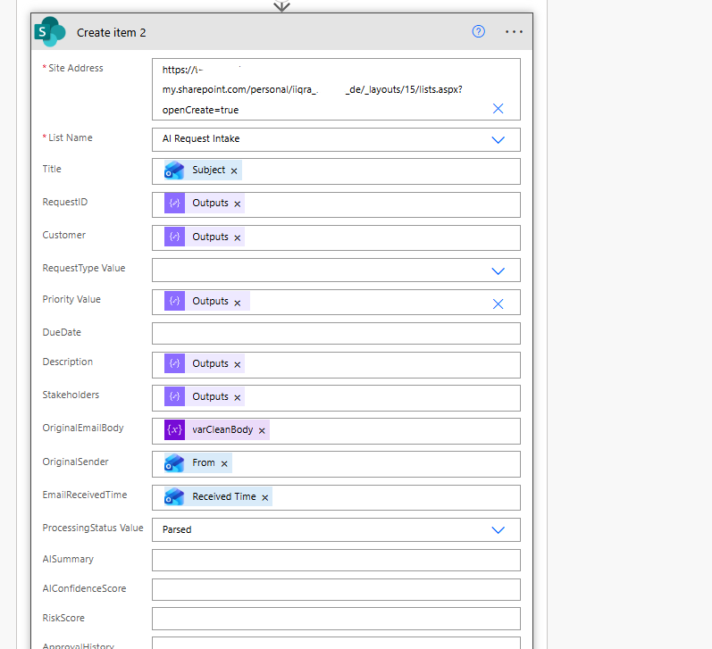
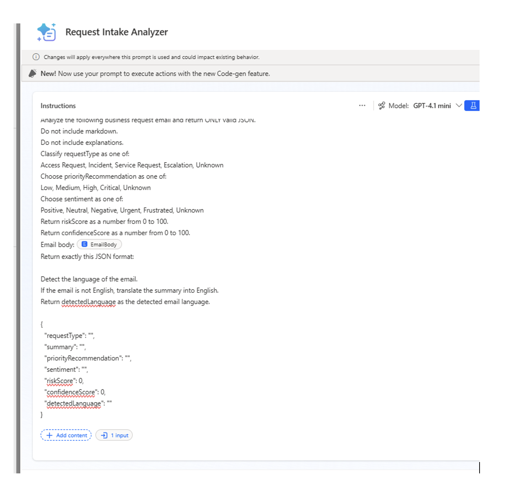
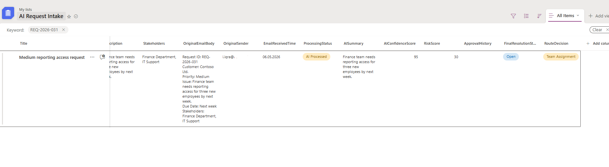
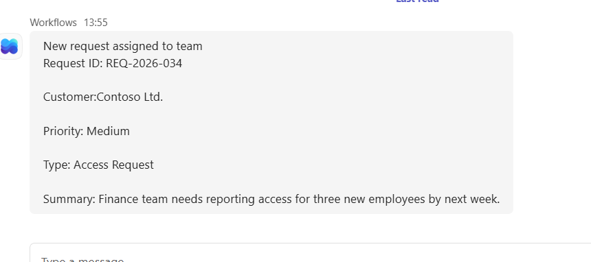
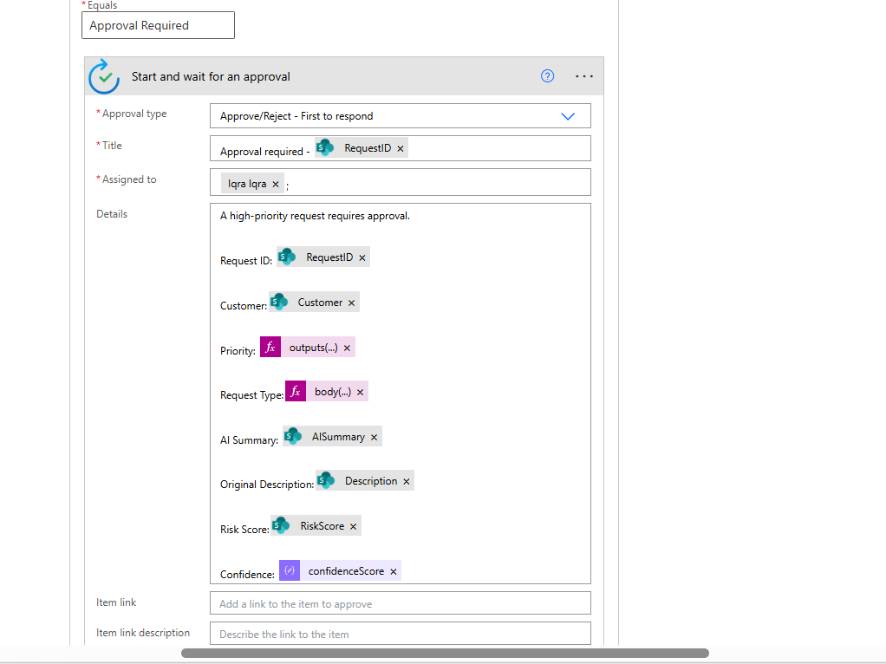

# AI-Powered Request Automation and Analytics System
> An enterprise-style AI-powered workflow automation project that converts unstructured email requests into structured, trackable, and analytics-ready business data.
## Project Overview

This project is an enterprise-style request processing system built with Microsoft Power Automate, AI Builder, SharePoint, Microsoft Teams, Planner, Outlook, and Approvals.

The solution monitors incoming emails, extracts structured and semi-structured request information, uses AI to classify and summarize requests, applies business rules, routes requests dynamically, stores the results, and supports approvals, escalations, SLA tracking, duplicate detection, and analytics.

## Business Problem

Organizations often receive business and service requests through inconsistent email formats. Manual triage can be slow, error-prone, and difficult to track.

This project automates request intake and converts unstructured email content into structured, analytics-ready data.

## Key Features

- Outlook email intake
- Keyword-based filtering
- HTML-to-text conversion
- Structured field parsing
- AI Builder classification and summarization
- Priority recommendation
- Sentiment analysis
- Risk score and confidence score
- Business rule validation
- Dynamic routing
- SharePoint request tracking
- Teams notifications
- Planner task creation
- Approval workflows
- Escalation handling
- SLA tracking
- Duplicate detection
- Auto-response email
- Multi-language support
- Audit logging
- Manual review queue
- AI feedback loop

## Tools Used

- Microsoft Power Automate
- AI Builder
- SharePoint Lists
- Microsoft Teams
- Microsoft Planner
- Outlook
- Approvals
- Power BI-ready data model

## Solution Architecture

Email → Power Automate → HTML-to-Text → Parsing Logic → AI Builder → Routing Logic → SharePoint → Teams / Planner / Approvals → Analytics

## Data Analytics Relevance

This project converts unstructured email requests into structured operational data. The captured data can be used for analytics such as request volume, request categories, SLA performance, priority distribution, approval outcomes, escalation rates, duplicate requests, risk score trends, and AI confidence monitoring.

## Example KPIs

- Total requests received
- Requests by category
- Requests by priority
- Requests by customer
- Average AI confidence score
- Average risk score
- Manual review percentage
- Approval rate
- Escalation rate
- Duplicate request rate
- SLA breach rate
- Open vs resolved requests

## Workflow Summary

1. Monitor incoming emails.
2. Filter relevant request emails.
3. Convert email body from HTML to plain text.
4. Extract structured fields such as Request ID, Customer, Priority, Description, and Stakeholders.
5. Use AI Builder to classify and summarize the request.
6. Generate confidence score, risk score, sentiment, and priority recommendation.
7. Apply routing rules.
8. Store request information in SharePoint.
9. Notify Teams, create Planner tasks, trigger approvals, or escalate depending on the route.
10. Track SLA, duplicate status, audit history, and final resolution.

## Repository Structure

```text
power-automate-ai-request-analytics/
│
├── README.md
├── architecture/
│   └── solution-architecture.md
│
├── documentation/
│   ├── project-overview.md
│   ├── setup-guide.md
│   ├── business-rules.md
│   ├── ai-builder-prompt.md
│   ├── power-automate-expressions.md
│   ├── testing-scenarios.md
│   └── lessons-learned.md
│
├── sample-data/
│   └── sample-emails.md
│
├── analytics/
│   ├── kpi-definitions.md
│   └── dashboard-requirements.md
│
└── screenshots/
    ├── Team assigment sharepoint.png
    ├── Uniqe-Duplicate request-sharePoint.png
    ├── ai-builder-output.png
    ├── approval-flow.png
    ├── connection-sharepoint.png
    ├── power-automate-flow.png
    ├── power-automate2.png
    ├── risk-score.png
    ├── sharepoint-list.png
    ├── team-assignment .png
    └── teams-notification.png
```
## Screenshots

### Power Automate Flow Overview



### Power Automate Flow - Additional View



### SharePoint Request Tracking List



### SharePoint Connection / Tracking View



### Team Assignment in SharePoint


### Unique and Duplicate Request Detection


### AI Builder Output



### Risk Score Output



### Teams Notification



### Team Assignment


### Approval Flow



## Contact

This project was created as part of my learning journey in workflow automation, AI Builder, Microsoft 365, and data analytics.

Feel free to connect with me:

- LinkedIn: [Iqra Ishfaq](https://www.linkedin.com/in/iqraishfaq/)
- GitHub Repository: [power-automate-ai-request-analytics](https://github.com/IqraIshfaq14/power-automate-ai-request-analytics)
- GitHub Profile: [IqraIshfaq14](https://github.com/IqraIshfaq14)
